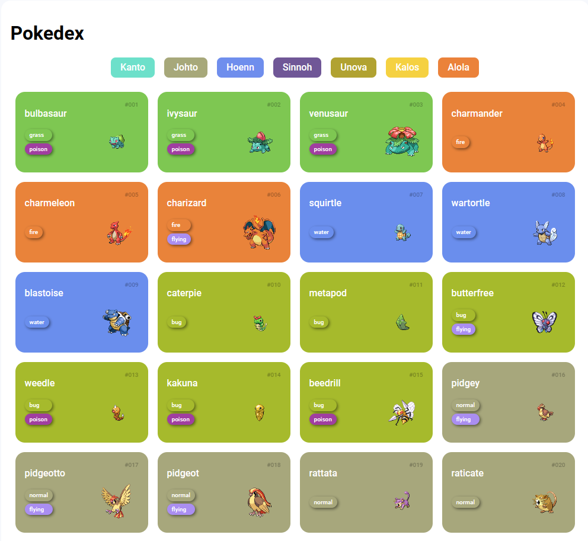

# Pokédex Web

Bem-vindo à Pokédex Web! Este é um projeto que permite aos usuários explorar informações sobre diferentes Pokémon, organizados por região. Você pode navegar pelas diferentes gerações de Pokémon e aprender mais sobre cada um deles.

## Recursos

- Visualize informações detalhadas sobre Pokémon, incluindo nome, número, tipos e imagem.
- Navegue pelas regiões de Kanto, Johto, Hoenn, Sinnoh, Unova, Kalos e Alola.
- Projeto de interface simples e amigável.

## Como Usar

1. Clone este repositório para sua máquina local.
2. Abra o arquivo `index.html` no seu navegador da web.
3. Clique nos botões das regiões para ver os Pokémon da região correspondente.
4. Explore as diferentes gerações de Pokémon e suas informações.

## Contribuição

Se você deseja contribuir para este projeto, sinta-se à vontade para criar um fork do repositório e enviar solicitações de pull com melhorias ou correções.

